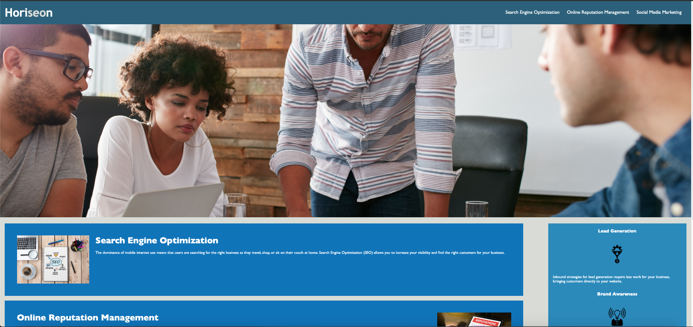

# 01-HTML-CSS-Git-Code-Refactor

## Description

In this repository, the Horiseon Social Solution Services Inc. website is refactored to be more accessible. The code was improved for accessibiltiy without changing the features or function of the website. This was done by using semantic html tags and adding alt tags to all images; the source code was modified also to remove all duplicate elements and to make it simplified and efficient.

Website URL: https://patelg1.github.io/01-HTML-CSS-Git-Code-Refactor/index.html

Repository URL: https://github.com/patelg1/01-HTML-CSS-Git-Code-Refactor

## Screenshot

